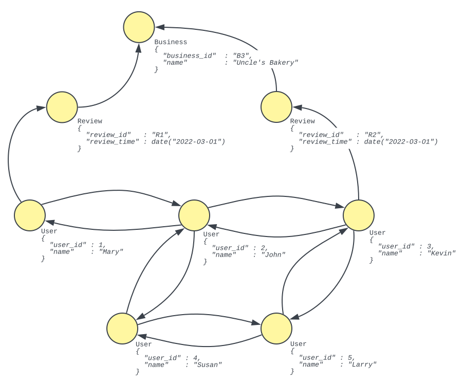

# Graphix Data Model
{: .no_toc }

## Table of Contents
{: .no_toc .text-delta }

1. TOC
{: toc }

## Property Graph Model
A _graph_ is a structure composed of sets of _graph elements_ known as _vertices_ and _edges_.
Edges exactly two vertices together.
A _property graph_ has four defining characteristics that differentiate itself from your bog-standard undirected simple graph:
- Each edge is _directed_.
  Consequently, given an edge _<u>e</u>_ that connects two vertices, we can talk about the _source vertex_ and the _destination vertex_ of _<u>e</u>_.
- Each graph element is associated with a _label_.
  In the context of the property graph model labels are used to group vertices with other vertices, and edge with other edges.
- Two pairs of vertices may be connected by more than one edge.
- Each graph element possesses a set of key-value pairs, also known as _properties_.

The property graph model (in contrast to other types of graph models) has received a lot of attention this past decade for its flexibility and ability to express other types of graph models by omitting or re-purposing certain characteristics of the property graph model itself.
For example, if your domain requires weights on your vertices or edges, you simply add a weight property to the appropriate graph elements.
If your domain requires undirected graphs, then simply assign an arbitrary direction to your edge and ignore the direction when querying.
Property graphs can even be used to represent RDF graphs by repurposing graph element labels as URIs.

To better explain this section on property graph models (and the majority of this entire reference), we introduce the Gelp example.
We want to model the following statement:

_**Users** and their friends make **Reviews** about **Businesses**._
{: .fw-400 .text-center }

Graphically, we can represent this statement as follows:

    

{: .code-example }

In the figure above, we describe the graph _schema_ of Gelp.
_<u>User</u>_, _<u>Review</u>_, and _<u>Business</u>_ are labels that are used to categorize vertices.
Between these vertices, there are three types of edges:

1. A _User_ could be _<u>FRIENDS_WITH</u>_ another _User_.
2. A _Review_ is _<u>MADE_BY</u>_ a _User_.
3. A _Review_ is _<u>ABOUT</u>_ a _Business_.

_FRIENDS_WITH_, _MADE_BY_, and _ABOUT_ are labels that are used to categorize these different types of edges.

Let us now take a look at an instance of Gelp.

    

{: .code-example }

In the figure above, there are five vertices of varying

## Queries on Property Graphs
It should be no surprise that the analysis of graphs
Graphs provide Analysis of graphs in general 
It's 
Graphs are While extracting 

### Pattern Matching

### Regular Path Queries (RPQ)

### Conjunctive Regular Path Queries (CRPQ)

## Graphix Data Model
Having described the property graph model, let us now describe the data model for Graphix.
The Asterix
