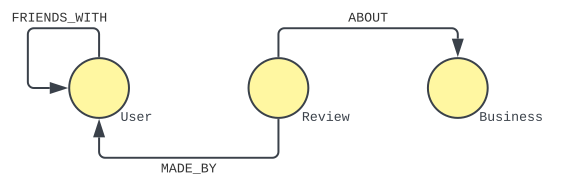

# Getting Started
{: .no_toc }

In this tutorial, we are going to start a 1-node Graphix cluster, establish a collection of AsterixDB datasets, build a graph over these datasets, and query the graph we just built.

## Table of Contents
{: .no_toc .text-delta }

1. TOC
{: toc }

## Starting a Sample Cluster

1. Head on over to the [Installation](../docs/installation.html) section and install AsterixDB + Graphix.
2. We are going to follow the instructions using a pre-built package. Execute the `quickstart.sh` script to start a 1-node cluster using the Graphix extension.
    ```bash
    ./quickstart.sh
    ```

## Building AsterixDB Datasets

1. For our tutorial, we use the "Gelp" example:
    **Users** and their friends make **Reviews** about **Businesses**.
    To start, let's create a new dataverse and all the aforementioned entities as datasets.
    ```
    CREATE DATAVERSE Gelp;
    USE Gelp;
    
    CREATE TYPE BusinessesType AS { business_id : string };
    CREATE DATASET Businesses (BusinessesType) PRIMARY KEY business_id;

    CREATE TYPE UsersType AS { user_id : bigint };
    CREATE DATASET Users (UsersType) PRIMARY KEY user_id;
       
    CREATE TYPE ReviewsType AS { review_id : string };
    CREATE DATASET Reviews (ReviewsType) PRIMARY KEY review_id;
    ```
    In the example above, all three datasets only have their primary keys defined.
    All other fields associated with each entity exist as _open_ fields.
2. Let's now insert some data into our dataverse. We'll start with our `Businesses` dataset.
    ```
    INSERT INTO Gelp.Businesses [
        { "business_id": "B1", "name": "Papa's Supermarket", "number": "909-123-6123" },
        { "business_id": "B2", "name": "Mother's Gas Station", "number": "111-724-1123" },
        { "business_id": "B3", "name": "Uncle's Bakery" }
    ];
    ```
    The three records inserted show two fields that were not defined in the `BusinessesType` data type: `name` and `number`.
    The last record illustrates the potential heterogeneity enabled by AsterixDB's document data model, where some businesses may not have a number attached to them.
3. Having populated our `Businesses` dataset, let's now move onto our `Users`:
    ```
    INSERT INTO Gelp.Users [
        { "user_id": 1, "name": "Mary", "friends": [ 2 ] },
        { "user_id": 2, "name": "John", "friends": [ 1, 3, 4 ] },
        { "user_id": 3, "name": "Kevin", "friends": [ 2, 5 ] },
        { "user_id": 4, "name": "Susan", "friends": [ 2, 5 ] },
        { "user_id": 5, "name": "Larry", "friends": [ 3, 4 ] }
    ];
    ```
    Similar to our `Businesses` records, these `Users` records inserted include two fields that weren't defined in their dataset type: `name` and `friends`.
    A user may have a name and an array of `user_id` values denoting their friends.
    The potential `friends` array of a user depicts a common _denormalized_ form of modeling one-to-many relationships, again enabled by AsterixDB's document data model.
4. Finally, let's move onto our last dataset: `Reviews`.
    ```
    INSERT INTO Gelp.Reviews [
        { "review_id": "R1", "user_id": 1, "business_id": "B3", "review_time": date("2022-03-01") },
        { "review_id": "R2", "user_id": 3, "business_id": "B3", "review_time": date("2022-03-01") },
        { "review_id": "R3", "user_id": 2, "business_id": "B3", "review_time": date("2022-03-02") },
        { "review_id": "R4", "user_id": 5, "business_id": "B1", "review_time": date("2022-03-03") },
        { "review_id": "R5", "user_id": 5, "business_id": "B2" }
    ];
    ```
    A review may include an associated user, business, and review time.

## Defining a Graphix Graph

1. At this point, we have not gone over anything new (in the context of AsterixDB).
    We now have a logical data model for Gelp with three defined datasets: `Users`, `Reviews`, and `Businesses`.
    To iterate, these three datasets are used to model the following:

    _**Users** and their friends make **Reviews** about **Businesses**._
    {: .fw-400 .text-center }

    Graphically, we can represent this statement as follows:
    
    <p align="center">
        
    </p>
    {: .code-example }

    We will now build a managed graph piece by piece.
    We start with a name for our graph: `GelpGraph`.
    ```
    CREATE GRAPH GelpGraph AS      
        ... ;
    ```
2. Now let us define our vertices.
    As depicted in the diagram above, we have three types of vertices: **User**, **Review**, and **Business**.
    In the context of the [Property Graph Model](../docs/query-model.html#property-graph-model), these vertex "types" will act as our vertex labels.

    1. Each vertex definition requires three pieces of information: the vertex _label_ the vertex _body_ and the vertex _key_.
    The vertices of label `Business` are defined using the `Gelp.Businesses` dataset, where each record in `Gelp.Businesses` corresponds to a vertex in our graph.
    The primary key of a `Business` vertex is the same as the logical primary key of its vertex body: `business_id`.
    With these three pieces of information, we define the schema of a `Business` vertex in the `GelpGraph` as such:
    ```
        VERTEX (:Business)
            PRIMARY KEY (business_id)
            AS Gelp.Businesses
    ```
    2. The vertices of label `User` are similarly defined using the `Gelp.Users` dataset, where each record in `Gelp.Users` corresponds to a vertex in our graph.
    The primary key of a `User` vertex is again the same as the logical primary key of its vertex body: `user_id`.
    We define the schema of a `User` vertex in the `GelpGraph` as such:
    ```
        VERTEX (:User)
            PRIMARY KEY (user_id)
            AS Gelp.Users
    ```
    3. We now move onto the last type of vertex: `Review`.
    A vertex of label `Review` is defined using the `Gelp.Reviews` dataset, with the same primary key as its body: `review_id`.
    Now suppose that we want to define `Review` vertices using `Gelp.Reviews` records that have a value for `review_time`.
    The body of a vertex is similar to that of an AsterixDB view body: we could either use an existing dataset as the vertex body, or a more general _query_.
    We will use the latter here for our `Review` vertex:
    ```
        VERTEX (:Review)
        PRIMARY KEY (review_id)
        AS (
            FROM
                Gelp.Reviews R
            WHERE   
                R.review_time IS NOT UNKNOWN
            SELECT VALUE 
                R 
        )
    ```
3. With our vertices defined, we now will define our edges.
    Referencing our diagram above, we have three types of relationships between our vertices:
    (1) _Reviews are **ABOUT** Businesses._
    (2) _Reviews are **MADE_BY** Users._
    (3) _Users are **FRIENDS_WITH** other Users._
    These relationship "types" will act as our edge labels.

    1. Each edge definition requires six pieces of information now: the source vertex _label_ and _key_, the destination vertex _label_ and _key_, the edge _label_, & the edge _body_. 
    The edges of label `ABOUT` have source vertices of the label `Review` and destination vertices of the label `Business`. 
    The edge bodies of label `ABOUT` are defined using <u>query</u> that references the `Gelp.Reviews` dataset.
    The goal of this edge body is to specify i) a field that will be used to connect (or `JOIN`) the edge body to the source label (i.e. our source key), ii) a field that will be used to connect the edge body to the destination label (i.e. our destination key), and iii) any edge properties.
    With these six pieces of information, we define the schema of an `ABOUT` edge in the `GelpGraph` as such:
    ```
        EDGE (:Review)-[:ABOUT]->(:Business)
            SOURCE KEY       (review_id)
            DESTINATION KEY  (business_id)
            AS (
                FROM    
                    Gelp.Reviews R
                WHERE   
                    R.review_time IS NOT UNKNOWN
                SELECT  
                    R.review_id,
                    R.business_id
            ) 
    ```
    The fact that our edge body shares a `FROM` clause with the vertex body for `Review` illustrates a trait of our underlying datasets: the `Reviews` dataset has an embedded 1:N relationship with our `Businesses` dataset.
    For those familiar with translating Entity-Relationship diagrams into SQL tables, the purpose of an edge body is to specify a _relationship table_ that holds foreign key references to two other tables (in our case, vertices).
    2. The edges of label `MADE_BY` are similarly defined to edges of label `ABOUT`.
    `MADE_BY` edges have source vertices of the label `Review` and destination vertices of the label `User`.
    Of our edge body, the key used to connect our edge to `Review` vertices is `(review_id)`.
    The key used to connect our edge to `User` vertices is `(user_id)`.
    We define the schema of a `MADE_BY` edge in the `GelpGraph` as such:
    ```
        EDGE (:Review)-[:MADE_BY]->(:User)
            SOURCE KEY       (review_id)
            DESTINATION KEY  (user_id)
            AS (
                FROM    
                    Gelp.Reviews R
                WHERE   
                    R.review_time IS NOT UNKNOWN
                SELECT  
                    R.review_id AS review_id,
                    R.user_id   AS user_id
            )
    ```
    3. The edges of label `FRIENDS_WITH` have source vertices of label `User` and destination vertices of the label `User`.
    The edge bodies are defined using an `UNNEST` query of the `Gelp.Users` dataset.
    Of our edge body, the key used to connect our edge to our source `User` vertex is `(user_id)`.
    The key used to connect our edge to our destination `User` vertex is `(friend)`.
    We define the schema of a `FRIENDS_WITH` edge in the `GelpGraph` as such:
    ```
        EDGE (:User)-[:FRIENDS_WITH]->(:User)
            SOURCE KEY       (user_id)
            DESTINATION KEY  (friend)
            AS (
                FROM    
                    Gelp.Users U,
                    U.friends F
                SELECT  
                    F         AS friend,
                    U.user_id AS user_id
            )
    ```
4. When we put all these pieces together, we get the following:
    ```
        CREATE GRAPH Gelp.GelpGraph AS
   
            VERTEX (:Business)
                PRIMARY KEY (business_id)
                AS Gelp.Businesses,
   
            VERTEX (:User)
                PRIMARY KEY (user_id)
                AS Gelp.Users,
   
            VERTEX (:Review)
                PRIMARY KEY (review_id)
                AS ( 
                    FROM    
                        Gelp.Reviews R
                    WHERE   
                        R.review_time IS NOT UNKNOWN
                    SELECT VALUE 
                        R 
                ),
            
            EDGE (:Review)-[:ABOUT]->(:Business)
                SOURCE KEY       (review_id)
                DESTINATION KEY  (business_id)
                AS ( 
                    FROM    
                        Gelp.Reviews R
                    WHERE   
                        R.review_time IS NOT UNKNOWN
                    SELECT  
                        R.review_id,
                        R.business_id 
                ),

            EDGE (:Review)-[:MADE_BY]->(:User)
                SOURCE KEY       (review_id)
                DESTINATION KEY  (user_id)
                AS ( 
                    FROM    
                        Gelp.Reviews R
                    WHERE   
                        R.review_time IS NOT UNKNOWN
                    SELECT  
                        R.review_id,
                        R.user_id 
                ),

            EDGE (:User)-[:FRIENDS_WITH]->(:User)
                SOURCE KEY       (user_id)
                DESTINATION KEY  (friend)
                AS ( 
                    FROM    
                        Gelp.Users U,
                        U.friends F
                    SELECT  
                        F         AS friend,
                        U.user_id AS user_id 
                );
    ```
    Issuing the statement above will create a managed graph in Graphix.


## Querying our Graphix Graph
1. Let's now query our data.
    To start, let's see what our `Business` vertices look like.
    We build the following gSQL++ query:
    ```
    FROM   
        GRAPH Gelp.GelpGraph
            (b:Business)
    SELECT 
        b;
    ```
    The query above starts by specifying the graph we are querying (the `FROM GRAPH Gelp.GelpGraph` line), followed by a graph pattern consisting of a single vertex whose label is to `Business`, concluding with a `SELECT` clause containing the variable of our vertex.
    For a more in-depth explanation on what a graph pattern is, see the [Graphix Query Model](../docs/query-model.html) page.
    If we issue our query, we get the following results:
    ```json
    { "business_id": "B1", "name": "Papa's Supermarket", "number": "909-123-6123" }
    { "business_id": "B2", "name": "Mother's Gas Station", "number": "111-724-1123" }
    { "business_id": "B3", "name": "Uncle's Bakery" }
    ```
    Our results are all records from the `Businesses` dataset, which makes sense given how we defined a `Business` vertex in our graph.

2. Let's now see what an edge looks like.
    In particular, let's see what all `ABOUT` edges return.
    We build the following gSQL++ query:
    ```
    FROM    
        GRAPH Gelp.GelpGraph
            (:Review)-[a:ABOUT]->(:Business)
    SELECT  
        a;
    ```
    Issuing the query above yields the following results:
    ```json
    { "a": { "review_id": "R1", "business_id": "B3" } }
    { "a": { "review_id": "R2", "business_id": "B3" } }
    { "a": { "review_id": "R3", "business_id": "B3" } }
    { "a": { "review_id": "R4", "business_id": "B1" } }
    ```
    In contrast to our `Business` vertices, our `Review` vertices and all connecting edges filter out records from the `Reviews` dataset if their `review_time` field is `NULL` or `MISSING`.
    The query being executed by AsterixDB is analogous to the following SQL++ query:
    ```
    FROM    
        Gelp.Reviews R,
        Gelp.Businesses B
    LET 
        a = {
            "review_id": R.review_id, 
            "business_id": R.business_id 
        }
    WHERE   
        R.business_id = B.business_id
    SELECT 
        a;
    ```

3. Suppose that we now want to find whether two users are connected by some number of friends in our graph.
    In this scenario, we need to describe a _path_ between two vertices instead of an edge.
    We build the following gSQL++ query:
    ```
    FROM      
        GRAPH Gelp.GelpGraph
            (u1:User)-[f:FRIENDS_WITH+]->(u2:User)
    LET       
        pathIDs = ( FROM VERTICES(f) fv SELECT VALUE fv.user_id )
    SELECT    
        u1.user_id AS u1_user_id,
        u2.user_id AS u2_user_id,
        pathIDs    AS pathIDs
    ORDER BY  
        u1_user_id, 
        u2_user_id;
    ```
    Issuing the query above yields the following results (shortened for brevity):
    ```json
    { "u1_user_id": 1, "u2_user_id": 2, "pathIDs": [ 1, 2 ] }
    { "u1_user_id": 1, "u2_user_id": 3, "pathIDs": [ 1, 2, 3 ] }
    { "u1_user_id": 1, "u2_user_id": 3, "pathIDs": [ 1, 2, 4, 5, 3 ] }
    { "u1_user_id": 1, "u2_user_id": 4, "pathIDs": [ 1, 2, 4 ] }
    { "u1_user_id": 1, "u2_user_id": 4, "pathIDs": [ 1, 2, 3, 5, 4 ] }
    { "u1_user_id": 1, "u2_user_id": 5, "pathIDs": [ 1, 2, 3, 5 ] }
    { "u1_user_id": 1, "u2_user_id": 5, "pathIDs": [ 1, 2, 4, 5 ] }
    { "u1_user_id": 2, "u2_user_id": 1, "pathIDs": [ 2, 1 ] }
    { "u1_user_id": 2, "u2_user_id": 3, "pathIDs": [ 2, 3 ] }
    { "u1_user_id": 2, "u2_user_id": 3, "pathIDs": [ 2, 4, 5, 3 ] }
    { "u1_user_id": 2, "u2_user_id": 4, "pathIDs": [ 2, 4 ] }
    { "u1_user_id": 2, "u2_user_id": 4, "pathIDs": [ 2, 3, 5, 4 ] }
    { "u1_user_id": 2, "u2_user_id": 5, "pathIDs": [ 2, 3, 5 ] }
    { "u1_user_id": 2, "u2_user_id": 5, "pathIDs": [ 2, 4, 5 ] }
    { "u1_user_id": 3, "u2_user_id": 1, "pathIDs": [ 3, 2, 1 ] }
    { "u1_user_id": 3, "u2_user_id": 1, "pathIDs": [ 3, 5, 4, 2, 1 ] }
    { "u1_user_id": 3, "u2_user_id": 2, "pathIDs": [ 3, 2 ] }
    { "u1_user_id": 3, "u2_user_id": 2, "pathIDs": [ 3, 5, 4, 2 ] }
    { "u1_user_id": 3, "u2_user_id": 4, "pathIDs": [ 3, 2, 4 ] }
    { "u1_user_id": 3, "u2_user_id": 4, "pathIDs": [ 3, 5, 4 ] }
    { "u1_user_id": 3, "u2_user_id": 5, "pathIDs": [ 3, 5 ] }
    ```
    
    The query above illustrates a _navigational graph pattern_, where `f` corresponds to a path instead of an edge.
    Vertices of a path are accessed using the `VERTICES` function, and edges of a path are accessed using the `EDGES` function.
   
4. The previous query yields a large number of results (too many to display here).
    Let's expand on the previous scenario: suppose we are not interested in multiple paths between the same two users, but instead we are interested in the _shortest_ path.
    We build the following gSQL++ query, taking advantage of how SQL++ treats grouping:
    ```
    FROM      
        GRAPH Gelp.GelpGraph
            (u1:User)-[f:FRIENDS_WITH+]->(u2:User)
    GROUP BY  
        u1, 
        u2
        GROUP AS g
    LET       
        shortestPath = (
            FROM     
                g
            LET      
                pathIDs = ( FROM VERTICES(g.f) fv SELECT VALUE fv.user_id )
            SELECT VALUE 
                pathIDs 
            ORDER BY 
                LEN(EDGES(g.f)) ASC
            LIMIT    
                1
        )[0]
    SELECT    
        u1.user_id   AS u1_user_id,
        u2.user_id   AS u2_user_id,
        shortestPath AS shortestPath,
        COUNT(*)     AS totalPaths;
    ```
    Issuing the query above yields the following results:
    ```json
    { "u1_user_id": 2, "u2_user_id": 1, "shortestPath": [ 2, 1 ], "totalPaths": 1 }
    { "u1_user_id": 2, "u2_user_id": 3, "shortestPath": [ 2, 3 ], "totalPaths": 2 }
    { "u1_user_id": 2, "u2_user_id": 4, "shortestPath": [ 2, 4 ], "totalPaths": 2 }
    { "u1_user_id": 2, "u2_user_id": 5, "shortestPath": [ 2, 3, 5 ], "totalPaths": 2 }
    { "u1_user_id": 1, "u2_user_id": 2, "shortestPath": [ 1, 2 ], "totalPaths": 1 }
    { "u1_user_id": 1, "u2_user_id": 3, "shortestPath": [ 1, 2, 3 ], "totalPaths": 2 }
    { "u1_user_id": 1, "u2_user_id": 4, "shortestPath": [ 1, 2, 4 ], "totalPaths": 2 }
    { "u1_user_id": 1, "u2_user_id": 5, "shortestPath": [ 1, 2, 3, 5 ], "totalPaths": 2 }
    { "u1_user_id": 3, "u2_user_id": 2, "shortestPath": [ 3, 2 ], "totalPaths": 2 }
    { "u1_user_id": 3, "u2_user_id": 1, "shortestPath": [ 3, 2, 1 ], "totalPaths": 2 }
    { "u1_user_id": 3, "u2_user_id": 4, "shortestPath": [ 3, 2, 4 ], "totalPaths": 2 }
    { "u1_user_id": 3, "u2_user_id": 5, "shortestPath": [ 3, 5 ], "totalPaths": 2 }
    { "u1_user_id": 4, "u2_user_id": 2, "shortestPath": [ 4, 2 ], "totalPaths": 2 }
    { "u1_user_id": 4, "u2_user_id": 1, "shortestPath": [ 4, 2, 1 ], "totalPaths": 2 }
    { "u1_user_id": 4, "u2_user_id": 3, "shortestPath": [ 4, 2, 3 ], "totalPaths": 2 }
    { "u1_user_id": 4, "u2_user_id": 5, "shortestPath": [ 4, 5 ], "totalPaths": 2 }
    { "u1_user_id": 5, "u2_user_id": 2, "shortestPath": [ 5, 3, 2 ], "totalPaths": 2 }
    { "u1_user_id": 5, "u2_user_id": 1, "shortestPath": [ 5, 3, 2, 1 ], "totalPaths": 2 }
    { "u1_user_id": 5, "u2_user_id": 3, "shortestPath": [ 5, 3 ], "totalPaths": 2 }
    { "u1_user_id": 5, "u2_user_id": 4, "shortestPath": [ 5, 4 ], "totalPaths": 2 }
    ```
    The query above can be thought of as grouping all distinct pairs of users `u1` and `u2`, then fetching the path out of all paths between `u1` and `u2` that has the shortest length.
    The ability to operate on groups using sub-queries in SQL++ gives gSQL++ users the power to express a rich set of typical path finding problems (e.g. weighted shortest paths).

## Stopping our Sample Cluster

1. Navigate to the pre-built package directory from before.
2. Execute the `quickstop.sh` script.

    ```bash
    ./quickstop.sh
    ```
