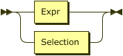
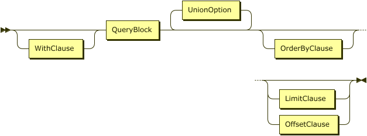
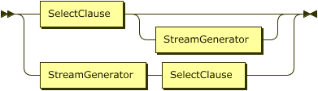
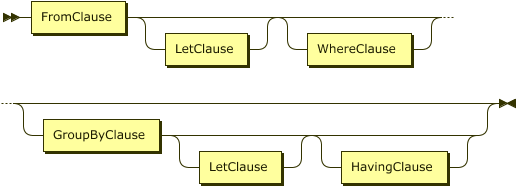

# Queries
{: .no_toc }

## Table of Contents
{: .no_toc .text-delta }

1. TOC
{: toc }

## Queries (Overview)

A _query_ can either be an expression (whose composition remains unchanged from SQL++), or a construction of _query blocks_.
A _query block_ may contain several clauses, including `SELECT`, `FROM`, `LET`, `WHERE`, `GROUP BY`, and `HAVING`.
The following productions are also unchanged from SQL++.

Query  

{: .text-delta .code-example }

Selection  

{: .text-delta .code-example }

Query Block  

{: .text-delta .code-example }

Stream Generator  

{: .text-delta .code-example }

Similar to SQL++ (but unlike SQL), GSQL++ allows the `SELECT` clause to appear either at the beginning or the end of a query black.
For some queries, placing the `SELECT` clause at the end may make a query block easier to understand because the `SELECT` clause refers to variables defined in the _stream generator_ production.

## FROM Clause

## MATCH Clause

## LET Clause

## WHERE Clause

## GROUP BY Clause

## HAVING Clause

## GROUP AS Clause

