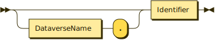
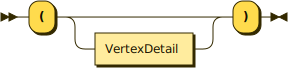
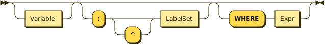
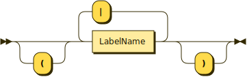
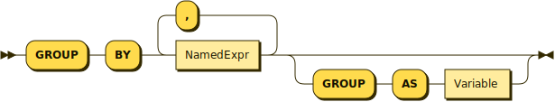

# Queries
{: .no_toc }


## Table of Contents
{: .no_toc .text-delta }

1. TOC
{: toc }

## Queries (Overview)

A _query_ can either be an expression (whose composition remains unchanged from SQL++), or a construction of _query blocks_.
A _query block_ may contain several clauses, including `SELECT`, `FROM`, `LET`, `WHERE`, `GROUP BY`, and `HAVING`.
The following productions are also unchanged from SQL++.

* * * 

Query
{: .text-gamma .fw-500 .lh-0 }
<p align="center">
    
</p>
{: .code-example }
<br>

Selection
{: .text-gamma .fw-500 .lh-0 }
<p align="center">
    
</p>
{: .code-example }
<br>

Query Block
{: .text-gamma .fw-500 .lh-0 }
<p align="center">
    
</p>
{: .code-example }
<br>

Stream Generator
{: .text-gamma .fw-500 .lh-0 }
<p align="center">
    
</p>
{: .code-example }

* * * 

Similar to SQL++ (but unlike SQL), gSQL++ allows the `SELECT` clause to appear either at the beginning or the end of a query black.
For some queries, placing the `SELECT` clause at the end may make a query block easier to understand because the `SELECT` clause refers to variables defined in the _stream generator_ production.


## `FROM` Clause

The purpose of a `FROM` clause is to iterate over a collection, binding a variable to each item in turn.
Graphix (and gSQL++) do not change the purpose of the `FROM` clause, rather the gSQL++ extension gives users an _additional_ method to specify variable bindings (in the form of vertices, edges, and paths).
Users are free to interleave the traditional `FromTerm` productions with gSQL++ `FromGraphTerm` productions to express truly synergistic document-based and graph-based queries.

* * *

FROM Clause
{: .text-gamma .fw-500 .lh-0 }
<p align="center">
    
</p>
{: .code-example }
<br>

From Term
{: .text-gamma .fw-500 .lh-0 }
<p align="center">
    
</p>
{: .code-example }
<br>

From Graph Term
{: .text-gamma .fw-500 .lh-0 }
<p align="center">
    
</p>
{: .code-example }
<br>

Qualified Name
{: .text-gamma .fw-500 .lh-0 }
<p align="center">
    
</p>
{: .code-example }
<br>

Named Expression (NamedExpr)
{: .text-gamma .fw-500 .lh-0 }
<p align="center">
    
</p>
{: .code-example }
<br>

JOIN Step
{: .text-gamma .fw-500 .lh-0 }
<p align="center">
    
</p>
{: .code-example }
<br>

UNNEST Step
{: .text-gamma .fw-500 .lh-0 }
<p align="center">
    
</p>
{: .code-example }
<br>

MATCH Step
{: .text-gamma .fw-500 .lh-0 }
<p align="center">
    
</p>
{: .code-example }


* * *

Below is a query that illustrates the usage of the gSQL++ extension to iterate over mappings of a single-edge pattern to our managed graph `GelpGraph`.
```
FROM    
    GRAPH GelpGraph
        (u1:User)-[:FRIENDS_WITH]->(u2:User)
SELECT  
    u1, 
    u2;
```

Putting aside the good practice of specifying explicit iteration variables in SQL++, the problem of specifying graph query patterns in nearly all non-trivial use cases involves describing more than one graph element.
Consequently, gSQL++ does **not** support implicit iteration variables for `FromGraphTerm`s.
This lack of support contrasts SQL++, where one-dataset queries are (arguably) more common.

## `MATCH` Expression

The purpose of a `FromGraphTerm` is to specify a (potentially navigational) graph pattern and introduce all mapping _permutations_ of the graph pattern to the underlying data.

* * *

MATCH Expression (MatchExpr)
{: .text-gamma .fw-500 .lh-0 }
<p align="center">
    
</p>
{: .code-example }
<br>

Pattern Expression (PatternExpr)
{: .text-gamma .fw-500 .lh-0 }
<p align="center">
    
</p>
{: .code-example }
<br>

Vertex Pattern
{: .text-gamma .fw-500 .lh-0 }
<p align="center">
    
</p>
{: .code-example }
<br>

Vertex Detail
{: .text-gamma .fw-500 .lh-0 }
<p align="center">
    
</p>
{: .code-example }
<br>

Edge Pattern
{: .text-gamma .fw-500 .lh-0 }
<p align="center">
    
</p>
{: .code-example }
<br>

Edge Detail
{: .text-gamma .fw-500 .lh-0 }
<p align="center">
    
</p>
{: .code-example }
<br>

Path Pattern
{: .text-gamma .fw-500 .lh-0 }
<p align="center">
    
</p>
{: .code-example }
<br>

Path Detail
{: .text-gamma .fw-500 .lh-0 }
<p align="center">
    
</p>
{: .code-example }
<br>

Label Set
{: .text-gamma .fw-500 .lh-0 }
<p align="center">
    
</p>
{: .code-example }
<br>

Repetition Quantifier
{: .text-gamma .fw-500 .lh-0 }
<p align="center">
    
</p>
{: .code-example }

* * *

The following query illustrates a basic graph pattern (BGP) matching query, which finds all users that have written a review.
```
FROM    
    GRAPH GelpGraph
        (r:Review)<-[mb:MADE_BY]-(u:User)
SELECT DISTINCT 
    u;
```
In the example above, two vertices and one edge are specified in the graph pattern.
An edge must always connect exactly two vertices, but a vertex can be specified without an edge. 

Graph patterns are implicitly joined with one another if they share a vertex variable.
Such style may be useful for improving the readability of your query.
The example below shows two graph patterns: the first of which finds all users that have written a review, and the second of which finds all users and their friends.
```
FROM    
    GRAPH GelpGraph
        (r:Review)<-[mb:MADE_BY]-(u1:User),
        (u1)-[:FRIENDS_WITH]->(u2:User)
SELECT DISTINCT 
    u1;
```
Conceptually, all permutations of both patterns are then joined on their common vertices.
If a pattern does not share any vertices with any other pattern in that specific `FromGraphTerm`, then we say that our pattern is _disjoint_.
Disjoint patterns are analogous to cartesian products in SQL: the binding tuple stream after the `FromGraphTerm` contains all possible pairs of the disjoint patterns.

Vertices and edges are the core of all graph queries, but often we may want to reason about our graph at the level of _paths_.
Paths are a collection of edges, and can be specified in gSQL++ in a similar manner to an edge pattern.
The difference with paths, however, is the use of a repetition quantifier after the variable and label specification.
Paths are described in Graphix using a regular expression of edge labels.
In the query below, we assign a variable of `p` to a path consisting of only 1 to 3 `FRIENDS_WITH` edges.
```
FROM    
    GRAPH GelpGraph
        (u1:User)<-[p:FRIENDS_WITH{1,3}]-(u2:User)
SELECT VALUE  
    PATH_VERTICES(p);
```

[//]: # (Alternation of edge labels can also be specified, using the `|` operator.)
[//]: # (The query below asks for all users `u1` and `u2` that are connected to each other by one to five `FRIENDS_WITH` or `MADE_BY` edges.)
[//]: # (```)
[//]: # (FROM    GRAPH GelpGraph)
[//]: # (MATCH   &#40;u1:User&#41;-[:&#40;FRIENDS_WITH|MADE_BY&#41;{1,5}]-&#40;u2:User&#41;)
[//]: # (SELECT  u1, u2;)
[//]: # (```)

[//]: # (Sometimes it may be helpful to specify which labels _should not_ appear in a pattern.)
[//]: # (The `^` operator allows a user to negate one or more labels.)
[//]: # (The query below is a modification of the previous query to only allow edges that are not labeled `MADE_BY`.)
[//]: # (```)
[//]: # (FROM    GRAPH GelpGraph)
[//]: # (MATCH   &#40;u1:User&#41;-[:^MADE_BY{1,5}]-&#40;u2:User&#41;)
[//]: # (SELECT  u1, u2;)
[//]: # (```)

Similar to SQL, gSQL++ offers optional binding to patterns with the `LEFT MATCH` clause.
The following example asks for users and their friends, as well as reviews if they have any.
```
FROM       
    GRAPH GelpGraph
        (u1:User)-[:FRIENDS_WITH]->(u2:User)
    LEFT MATCH 
        (u1)<-[mb:MADE_BY]-(r:Review)
SELECT     
    u1, 
    u2, 
    mb, 
    r;
```
gSQL++ will only bind to variables declared in a `LEFT MATCH` clause if (and only if) the corresponding pattern can be matched in full.
In the example above, if there was a `mb` edge record that was connected to `u1` but not to any existing user, then `MISSING` would be bound to both `mb` and `r` for that instance.
The flexibility of AsterixDB's data model means that edges in Graphix may not be "consistent".
gSQL++ will always work in units of patterns, not individual collections.

_Features such as edge label alternation and negation are planned, but not implemented yet._

## `LET` Clause

`LET` clauses serve the same purpose in gSQL++ as they do in SQL++: for specifying an expression once, but referring to the expression elsewhere one or more times elsewhere in your query.
Refer to the AsterixDB documentation on `LET` clauses [here](https://asterixdb.apache.org/docs/0.9.8/sqlpp/manual.html#Let_clauses) for more details.

* * *

LET Clause
{: .text-gamma .fw-500 .lh-0 }
<p align="center">
    
</p>
{: .code-example }

* * * 

## `WHERE` Clause

`WHERE` clauses serve the same purpose in gSQL++ as they do in SQL++: to filter out records that do not satisfy a certain condition, specified using variables from the `FROM` clause.
Refer to the AsterixDB documentation on `WHERE` clauses [here](https://asterixdb.apache.org/docs/0.9.8/sqlpp/manual.html#WHERE_Clause) for more details.

* * *

WHERE Clause
{: .text-gamma .fw-500 .lh-0 }
<p align="center">
    
</p>
{: .code-example }

* * * 

## `GROUP BY` Clause

`GROUP BY` clauses serve the same purpose in gSQL++ as they do in SQL++: to organize records into groupings defined by a grouping element.
gSQL++ also inherits the same grouping semantics from SQL: after a `GROUP BY`, the only fields that can referred to are fields from the grouping fields, or aggregate functions on the group itself (`GROUP AS` offers more flexibility here, as we'll see later).
Refer to the AsterixDB documentation on grouping [here](https://asterixdb.apache.org/docs/0.9.8/sqlpp/manual.html#Grouping) for more details.

* * *

GROUP BY Clause
{: .text-gamma .fw-500 .lh-0 }
<p align="center">
    
</p>
{: .code-example }

* * * 

The following query retrieves how many 1 to 5 hop paths there are for every pair of users.
```
FROM      
    GRAPH GelpGraph
        (u1:User)-[{1,5}]->(u2:User)
GROUP BY  
    u1, 
    u2
SELECT    
    u1       AS u1, 
    u2       AS u2, 
    COUNT(*) AS cnt;
```
In the example above, the `FROM` clause produces records for all paths (of 1 to 5 hops) between `u1` and `u2`.
The `GROUP BY` clause then generates groups for all unique pairs of `u1` and `u2`, and then counts all records in each group, for each group.

`GROUP AS` clauses serve the same purpose in gSQL++ as they do in SQL++: to preserve all records in a group, as they were before the `GROUP BY` clause.
Refer to the AsterixDB documentation on `GROUP AS` clauses [here](https://asterixdb.apache.org/docs/0.9.8/sqlpp/manual.html#GROUP_AS_Clause) for more details.
When `GROUP AS` is used in conjunction with navigational pattern matching, one can express a wide array of queries that other languages would either dedicate special syntax for, or expose as a special function.
The following query asks for the shortest path between two users `u1` and `u2`.
```
FROM     
    GRAPH GelpGraph
        (u1:User)-[p+]->(u2:User)
GROUP BY  
    u1, 
    u2
    GROUP AS g
LET       
    shortestPath = (
        FROM
            g
        SELECT VALUE 
            g.p
        ORDER BY 
            LEN(EDGES(g.p)) ASC
        LIMIT    
            1
    )[0]
SELECT    
    u1, 
    u2, 
    shortestPath;
```
In the example above, we specify a subquery that operates on an individual group, as opposed to all paths in the `FROM` clause.
In doing so, we can easily retrieve the shortest path by sorting our group by path length (`LEN(EDGES(g.p))`) and limiting our result set to 1.

Suppose now we want to modify our previous example to find the _two_ shortest paths containing users with the name "Mary".
The following query modifies only the `shortestPath` subquery from the previous example and nothing else:
```
FROM     
    GRAPH GelpGraph
        (u1:User)-[p+]->(u2:User)
GROUP BY  
    u1, 
    u2
    GROUP AS g
LET       
    shortestPath = (
        FROM
            g
        WHERE
            SOME v IN VERTICES(g.p) SATISFIES v.name = "Mary"
        SELECT VALUE 
            g.p
        ORDER BY 
            LEN(EDGES(g.p)) ASC
        LIMIT    
            2
    )[0]
SELECT    
    u1, 
    u2, 
    shortestPath;
```
Graphix users don't need to learn a new type of language / syntax to reason about path problems here, they can simply reuse their existing SQL / SQL++ knowledge.


## `HAVING` Clause

`HAVING` clauses serve the same purpose in gSQL++ as they do in SQL++: to filter out _groups_ that do not satisfy a certain condition, specified using aggregates on the group itself.
Refer to the AsterixDB documentation on `HAVING` clauses [here](https://asterixdb.apache.org/docs/0.9.8/sqlpp/manual.html#HAVING_Clause) for more details.

* * *

HAVING Clause
{: .text-gamma .fw-500 .lh-0 }
<p align="center">
    
</p>
{: .code-example }

* * * 

