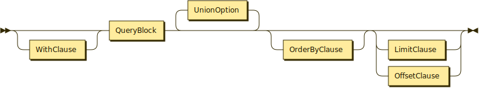
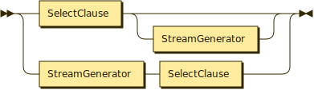
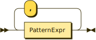
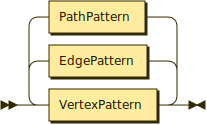
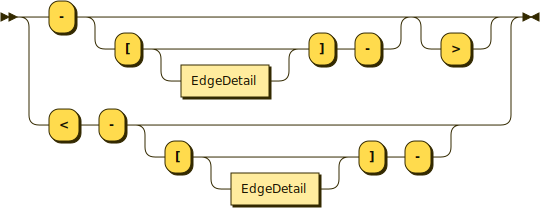
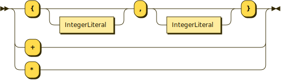

# Queries
{: .no_toc }


## Table of Contents
{: .no_toc .text-delta }

1. TOC
{: toc }


## Queries (Overview)

A _query_ can either be an expression (whose composition remains unchanged from SQL++), or a construction of _query blocks_.
A _query block_ may contain several clauses, including `SELECT`, `FROM`, `LET`, `WHERE`, `GROUP BY`, and `HAVING`.
The following productions are also unchanged from SQL++.

* * * 

Query
{: .text-gamma .fw-500 .lh-0 }
<p align="center">
    
</p>
{: .code-example }
<br>

Selection
{: .text-gamma .fw-500 .lh-0 }
<p align="center">
    
</p>
{: .code-example }
<br>

Query Block
{: .text-gamma .fw-500 .lh-0 }
<p align="center">
    
</p>
{: .code-example }
<br>

Stream Generator
{: .text-gamma .fw-500 .lh-0 }
<p align="center">
    
</p>
{: .code-example }

* * * 

Similar to SQL++ (but unlike SQL), gSQL++ allows the `SELECT` clause to appear either at the beginning or the end of a query black.
For some queries, placing the `SELECT` clause at the end may make a query block easier to understand because the `SELECT` clause refers to variables defined in the _stream generator_ production.


## FROM Clause

The purpose of a `FROM` clause is to iterate over a collection.
An additional function of the `FROM` clause in gSQL++ is to introduce an iteration over collections of graph elements (vertices, edges, and paths) involved in mapping a navigational graph query pattern (i.e. introduced via the `MATCH` clause) to a graph schema (an unmanaged `GraphConstructor` or a managed graph identified by its `QualifiedName`).

* * *

FROM Clause
{: .text-gamma .fw-500 .lh-0 }
<p align="center">
    
</p>
{: .code-example }
<br>

Qualified Name
{: .text-gamma .fw-500 .lh-0 }
<p align="center">
    
</p>
{: .code-example }
<br>

Named Expression (NamedExpr)
{: .text-gamma .fw-500 .lh-0 }
<p align="center">
    
</p>
{: .code-example }
<br>

FROM Term
{: .text-gamma .fw-500 .lh-0 }
<p align="center">
    
</p>
{: .code-example }
<br>

JOIN Step
{: .text-gamma .fw-500 .lh-0 }
<p align="center">
    
</p>
{: .code-example }
<br>

UNNEST Step
{: .text-gamma .fw-500 .lh-0 }
<p align="center">
    
</p>
{: .code-example }

* * *

Below is a query that illustrates the usage of gSQL++'s extended `FROM` clause to iterate over mappings of a single-edge pattern to our managed graph `GelpGraph`.
```
FROM    GRAPH GelpGraph
MATCH   (u1:User)-[:FRIENDS_WITH]->(u2:User)
SELECT  u1, u2;
```

To query over an unmanged graph, users can specify a `GraphConstructor` expression in lieu of the named of a managed graph:
```
FROM    GRAPH AS

  VERTEX           (:User)
  PRIMARY KEY      (user_id)
  AS Gelp.Users,

  EDGE             (:User)-[:FRIENDS_WITH]->(:User)
  SOURCE KEY       (user_id)
  DESTINATION KEY  (friend)
  AS ( FROM   Gelp.Users U
       UNNEST  U.friends F
       SELECT  F AS friend,
               U.user_id )

MATCH   (u1:User)-[:FRIENDS_WITH]->(u2:User)
SELECT  u1, u2;
```

Putting aside the good practice of specifying explicit iteration variables in SQL++, the problem of specifying graph query patterns in nearly all non-trivial use cases involve describing more than one graph element.
Consequently, gSQL++ does **not** support implicit iteration variables when the source `FromClause` is iterating over a collection of `MATCH` to graph schema mappings.
This lack of support contrasts SQL++, where one-dataset queries are (arguably) more common.

## MATCH Clause

The purpose of a `MATCH` clause is to specify a (potentially navigational) graph pattern and introduce all mapping _permutations_ of the graph pattern to the underlying data.

* * *

MATCH Clause
{: .text-gamma .fw-500 .lh-0 }
<p align="center">
    
</p>
{: .code-example }
<br>

MATCH Expression (MatchExpr)
{: .text-gamma .fw-500 .lh-0 }
<p align="center">
    
</p>
{: .code-example }
<br>

MATCH Step
{: .text-gamma .fw-500 .lh-0 }
<p align="center">
    
</p>
{: .code-example }
<br>

Pattern Expression (PatternExpr)
{: .text-gamma .fw-500 .lh-0 }
<p align="center">
    
</p>
{: .code-example }
<br>

Vertex Pattern
{: .text-gamma .fw-500 .lh-0 }
<p align="center">
    
</p>
{: .code-example }
<br>

Edge Pattern
{: .text-gamma .fw-500 .lh-0 }
<p align="center">
    
</p>
{: .code-example }
<br>

Edge Detail
{: .text-gamma .fw-500 .lh-0 }
<p align="center">
    
</p>
{: .code-example }
<br>

Repetition Quantifier
{: .text-gamma .fw-500 .lh-0 }
<p align="center">
    
</p>
{: .code-example }

* * *

The following query illustrates a basic graph pattern (BGP) matching query, which finds all users that have written a review.
```
FROM    GRAPH GelpGraph
MATCH   (r:Review)<-[mb:MADE_BY]-(u:User)
SELECT  DISTINCT u;
```
In the example above, two vertices and one edge are specified in the graph pattern.
An edge must always connect exactly two vertices, but a vertex can be specified without an edge. 

Graph patterns are implicitly joined with one another if they share a vertex variable.
Such style may be useful for improving the readability of your query.
The example below shows two graph patterns: the first of which finds all users that have written a review, and the second of which finds all users and their friends.
```
FROM    GRAPH GelpGraph
MATCH   (r:Review)<-[mb:MADE_BY]-(u1:User),
        (u1)-[:FRIENDS_WITH]->(u2:User)
SELECT  DISTINCT u1;
```
Conceptually, all permutations of both patterns are then joined on their common vertices.
If a pattern does not share any vertices with any other pattern in that specific `FROM GRAPH` clause, then we say that our pattern is _disjoint_.
Disjoint patterns are analogous to cartesian products in SQL: the binding tuple stream after the `MATCH` clause contains all possible pairs of the disjoint patterns.

Vertices and edges are the core of all graph queries, but often we may want to reason about our graph at the level of _paths_.
Paths are a collection of edges, and can be specified in gSQL++ using two constructs: inside of an edge pattern or outside of an edge pattern.
The following query demonstrates the former, where we assign a variable of `p` to our path within the edge pattern production.
```
FROM    GRAPH GelpGraph
MATCH   (u1:User)<-[p:FRIENDS_WITH{1,3}]-(u2:User)
SELECT  PATH_VERTICES(p);
```

The following query demonstrates the latter, where we assign a variable of `p` to our path outside the pattern.
If a path is specified using multiple edge patterns, then assigning `p` using `AS` will bind `p` to all edge patterns in the path (as opposed to the path within the edge pattern itself).
```
FROM    GRAPH GelpGraph
MATCH   (u1:User)<-[:FRIENDS_WITH{1,3}]-(u2:User) AS p
SELECT  PATH_VERTICES(p);
```

The example above also illustates a _navigational_ query pattern, where `p` logically represents a path between one `FRIENDS_WITH` edge and three `FRIENDS_WITH` edges.
The use of curly braces `{` `}` in an edge pattern changes how the variable bound to that specific edge pattern is processed.
If there are no curly braces, then the edge pattern is processed as an edge (and consequently, all edge functions can be used with said variable).
If curly braces are present, then the edge pattern is processed as a _path_.
The variable bound to this edge pattern path is functionally a path variable, and thus only path functions can be used.

Alternation of edge labels can also be specified, using the `|` operator.
The query below asks for all users `u1` and `u2` that are connected to each other by one to five `FRIENDS_WITH` or `MADE_BY` edges.
```
FROM    GRAPH GelpGraph
MATCH   (u1:User)-[:(FRIENDS_WITH|MADE_BY){1,5}]-(u2:User)
SELECT  u1, u2;
```

Similar to SQL, gSQL++ offers optional binding to patterns with the `LEFT MATCH` clause.
The following example asks for users and their friends, as well as reviews if they have any.
```
FROM       GRAPH GelpGraph
MATCH      (u1:User)-[:FRIENDS_WITH]->(u2:User)
LEFT MATCH (u1)<-[mb:MADE_BY]-(r:Review)
SELECT     u1, u2, mb, r;
```
gSQL++ will only bind to variables declared in a `LEFT MATCH` clause if (and only if) the corresponding pattern can be matched in full.
In the example above, if there was a `mb` edge record that was connected to `u1` but not to any existing user, then `MISSING` would be bound to both `mb` and `r` for that instance.
The flexibility of AsterixDB's data model means that edges in Graphix may not be "consistent".
gSQL++ will always work in units of patterns, not individual collections.

## LET Clause

`LET` clauses serve the same purpose in gSQL++ as they do in SQL++: for specifying an expression once, but referring to the expression elsewhere one or more times elsewhere in your query.
Refer to the AsterixDB documention on `LET` clauses [here](https://asterixdb.apache.org/docs/0.9.8/sqlpp/manual.html#Let_clauses) for more details.

* * *

LET Clause
{: .text-gamma .fw-500 .lh-0 }
<p align="center">
    
</p>
{: .code-example }
<br>

* * * 

## WHERE Clause

`WHERE` clauses serve the same purpose in gSQL++ as they do in SQL++: to filter out records that do not satisfy a certain condition, specified using variables from the `FROM` clause.
Refer to the AsterixDB documention on `WHERE` clauses [here](https://asterixdb.apache.org/docs/0.9.8/sqlpp/manual.html#WHERE_Clause) for more details.

* * *

WHERE Clause
{: .text-gamma .fw-500 .lh-0 }
<p align="center">
    
</p>
{: .code-example }

* * * 

## GROUP BY Clause

`GROUP BY` clauses serve the same purpose in gSQL++ as they do in SQL++: to organize records into groupings defined by a grouping element.
gSQL++ also inherits the same grouping semantics from SQL: after a `GROUP BY`, the only fields that can referred to are fields from the grouping fields, or aggregate functions on the group itself (`GROUP AS` offers more flexibility here, as we'll see later).
Refer to the AsterixDB documention on grouping [here](https://asterixdb.apache.org/docs/0.9.8/sqlpp/manual.html#Grouping) for more details.

* * *

GROUP BY Clause
{: .text-gamma .fw-500 .lh-0 }
<p align="center">
    
</p>
{: .code-example }
<br>

Grouping Element
{: .text-gamma .fw-500 .lh-0 }
<p align="center">
    
</p>
{: .code-example }
<br>

Ordinary Grouping Set
{: .text-gamma .fw-500 .lh-0 }
<p align="center">
    
</p>
{: .code-example }
<br>

* * * 

The following query retrieves how many 1 to 5 hop paths there are for every pair of users.
```
FROM      GRAPH GelpGraph
MATCH     (u1:User)-[:{1,5}]-(u2:User)
GROUP BY  u1, u2
SELECT    u1, u2, COUNT(*) AS cnt;
```
In the example above, the `FROM` clause produces records for all paths (of 1 to 5 hops) between `u1` and `u2`.
The `GROUP BY` clause will then generate groups for all unique pairs of `u1` and `u2`, and then count all records in each group, for each group.

## HAVING Clause

`HAVING` clauses serve the same purpose in gSQL++ as they do in SQL++: to filter out _groups_ that do not satisfy a certain condition, specified using aggregates on the group itself.
Refer to the AsterixDB documention on `HAVING` clauses [here](https://asterixdb.apache.org/docs/0.9.8/sqlpp/manual.html#HAVING_Clause) for more details.

* * *

HAVING Clause
{: .text-gamma .fw-500 .lh-0 }
<p align="center">
    
</p>
{: .code-example }

* * * 

## GROUP AS Clause

`GROUP AS` clauses serve the same purpose in gSQL++ as they do in SQL++: to preserve all records in a group, as they were before the `GROUP BY` clause.
Refer to the AsterixDB documention on `GROUP AS` clauses [here](https://asterixdb.apache.org/docs/0.9.8/sqlpp/manual.html#GROUP_AS_Clause) for more details.

* * *

GROUP AS Clause
{: .text-gamma .fw-500 .lh-0 }
<p align="center">
    
</p>
{: .code-example }

* * * 

When `GROUP AS` is used in conjunction with navigational pattern matching, one can express a wide array of queries that other languages would either dedicate special syntax for, or expose as a special function.
The following query asks for the shortest path (of 1 to 5 hops) between two users `u1` and `u2`.
```
FROM      GRAPH GelpGraph
MATCH     (u1:User)-[p:{1,5}]-(u2:User)
GROUP BY  u1, u2
GROUP AS  g
LET       shortestPath = (
            FROM     g gi
            SELECT   VALUE gi.p
            ORDER BY LEN(gi.p) ASC
            LIMIT    1
          )[0]
SELECT    u1, u2, shortestPath;
```
In the example above, we specify a subquery that operates on an individual group, as opposed to all paths in the `FROM` clause.
In doing so, we can easily retrieve the shortest path by sorting our group by path length (`LEN(gi.p)`) and limiting our result set to 1.

Suppose now we want to modify our previous example to find the _two_ shortest paths (of 1 to 5 hops) that don't involve a certain user.
The following query modifies only the `shortestPath` subquery from the previous example and nothing else:
```
FROM      GRAPH GelpGraph
MATCH     (u1:User)-[p:{1,5}]-(u2:User)
GROUP BY  u1, u2
GROUP AS  g
LET       shortestPath = (
            FROM     g gi
            SELECT   VALUE gi.p
            WHERE    EVERY v IN VERTICES(gi.p)
                     SATISFIES NOT ( LABEL(v) = "User" AND 
                                     v.user_id = 4 )
            ORDER BY LEN(gi.p) ASC
            LIMIT    2
          )[0]
SELECT    u1, u2, shortestPath;
```
Graphix users don't need to learn a new type of language / syntax to reason about path problems here, they can simply reuse their existing SQL / SQL++ knowledge.
