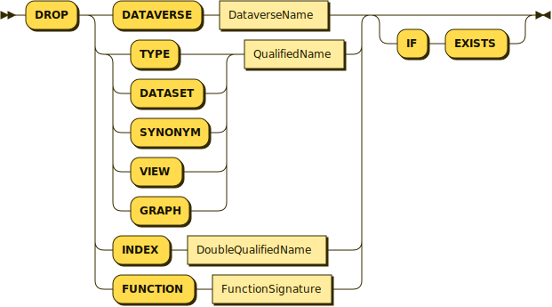
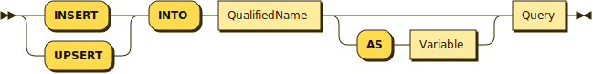

# Statements
{: .no_toc }

## Table of Contents
{: .no_toc .text-delta } 

1. TOC
{: toc }

## Statements (Overview)

In addition to queries, gSQL++ needs to support statements for a) managing the definition of graphs, and b) for controlling the context used in query compilation & evaluation.

## DECLARE Statement

<p align="center">
    
</p>
{: .code-example }

## CREATE Statement

<p align="center">
    
</p>
{: .code-example }

## DROP Statement

<p align="center">
    
</p>
{: .code-example }

## SET Statement

<p align="center">
    
</p>
{: .code-example }

The `SET` statement allows users to specify 

## (IN|UP)SERT Statement

<p align="center">
    
</p>
{: .code-example }

gSQL++ does not directly support the creation of vertices and edges, as each vertex and edge body represents a _view_ of your logical model.
Such an action is akin to deleting a record from a SQL++ (or SQL) view.

## DELETE Statement

<p align="center">
    
</p>
{: .code-example }

gSQL++ also does not directly support the deletion of vertices and edges.
Users can however use a gSQL++ query to locate record they want to delete.
Suppose that we want to delete all users that have made reviews for a fake business.
We can accomplish this deletion using a correlated sub-query:

```
DELETE
FROM    Users AS u
WHERE   EXISTS (
    FROM    GRAPH GelpGraph
    MATCH   (gu:User)-(:Review)-(gb:Business)
    WHERE   "fake" IN gb.annotations AND
            u = gu
    SELECT  1
);
```
