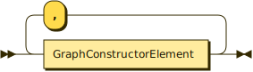
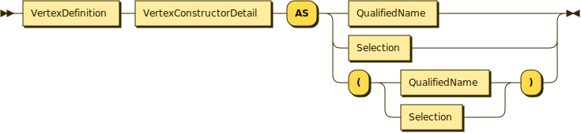
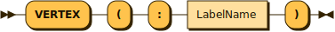
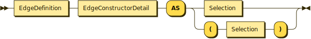
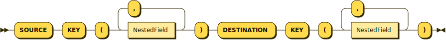
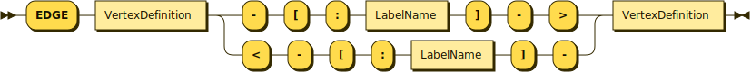

# Statements
{: .no_toc }

## Table of Contents
{: .no_toc .text-delta } 

1. TOC
{: toc }

## Statements (Overview)

In addition to queries, gSQL++ needs to support statements for a) managing the definition of graphs, and b) for controlling the context used in query compilation & evaluation.

## `CREATE` Statement

The `CREATE` statement is used for creating dataverses and other persistent artifacts within a dataset.
In Graphix, if users want to create a AsterixDB managed graph whose metadata / name is persisted across requests, they would use the `CREATE GRAPH` statement as opposed to defining a temporary graph using the `WITH GRAPH` clause.

* * *

CREATE Statement
{: .text-gamma .fw-500 .lh-0 }
<p align="center">
    
</p>
{: .code-example }
<br>

CREATE GRAPH Statement
{: .text-gamma .fw-500 .lh-0 }
<p align="center">
    
</p>
{: .code-example }
<br>

Graph Constructor
{: .text-gamma .fw-500 .lh-0 }
<p align="center">
    
</p>
{: .code-example }
<br>

Vertex Constructor
{: .text-gamma .fw-500 .lh-0 }
<p align="center">
    
</p>
{: .code-example }
<br>

Vertex Constructor Detail
{: .text-gamma .fw-500 .lh-0 }
<p align="center">
    
</p>
{: .code-example }
<br>

Vertex Definition
{: .text-gamma .fw-500 .lh-0 }
<p align="center">
    
</p>
{: .code-example }
<br>

Edge Constructor
{: .text-gamma .fw-500 .lh-0 }
<p align="center">
    
</p>
{: .code-example }
<br>

Edge Constructor Detail
{: .text-gamma .fw-500 .lh-0 }
<p align="center">
    
</p>
{: .code-example }
<br>

Edge Definition
{: .text-gamma .fw-500 .lh-0 }
<p align="center">
    
</p>
{: .code-example }

* * *

A graph in Graphix is specified by using the _graph constructor_ production.
A graph constructor is used to specify the schema of a graph containing one or more vertices, and zero or more edges.

To specify a vertex in a graph schema, the _vertex constructor_ production is used.
A vertex constructor consists of a) a single label (specified using a vertex pattern), b) a primary key, and c) a vertex body specified after the `AS` keyword.
The _edge constructor_ production is used to specify an edge in a graph schema, and consists of a) a source vertex label (specified using a vertex pattern), b) a destination vertex label (again, specified using a vertex pattern), c) an edge label (specified using an edge pattern), d) a direction (using arrows, again from the edge pattern), e) a source key, f) a destination key, and g) an edge body.
The source key and destination key will be used when connecting the edge itself to its source vertex and destination vertex.

An example `CREATE GRAPH` is given below:
```
CREATE GRAPH Gelp.GelpGraph AS

    VERTEX (:Business)
        PRIMARY KEY (business_id)
        AS Gelp.Businesses,

    VERTEX (:User)
        PRIMARY KEY (user_id)
        AS Gelp.Users,

    VERTEX (:Review)
        PRIMARY KEY (review_id)
        AS ( 
            FROM    
                Gelp.Reviews R
            WHERE   
                R.review_time IS NOT UNKNOWN
            SELECT VALUE 
                R 
        ),
    
    EDGE (:Review)-[:ABOUT]->(:Business)
        SOURCE KEY       (review_id)
        DESTINATION KEY  (business_id)
        AS ( 
            FROM    
                Gelp.Reviews R
            WHERE   
                R.review_time IS NOT UNKNOWN
            SELECT  
                R.review_id,
                R.business_id 
        ),

    EDGE (:Review)-[:MADE_BY]->(:User)
        SOURCE KEY       (review_id)
        DESTINATION KEY  (user_id)
        AS ( 
            FROM    
                Gelp.Reviews R
            WHERE   
                R.review_time IS NOT UNKNOWN
            SELECT  
                R.review_id,
                R.user_id 
        ),

    EDGE (:User)-[:FRIENDS_WITH]->(:User)
        SOURCE KEY       (user_id)
        DESTINATION KEY  (friend)
        AS ( 
            FROM    
                Gelp.Users U,
                U.friends F
            SELECT  
                F         AS friend,
                U.user_id AS user_id 
        );
```

Although vertex and edge patterns are used to specify our graph schema, the following constraints are imposed on any defined graph:
1. A vertex must have exactly one label.
2. An edge must have exactly one label.
3. The source vertex of an edge must have exactly one label.
4. The destination vertex of an edge must have exactly one label.
5. An edge must be directed.
6. An edge must reference a vertex that is defined within that schema.

## `DROP` Statement

The `DROP` statement is the inverse of the `CREATE` statement, and is used to drop dataverses, datatypes, indexes, functions, synonyms, and graphs.

* * *

DROP GRAPH Statement
{: .text-gamma .fw-500 .lh-0 }
<p align="center">
    
</p>
{: .code-example }

* * *

## `SET` Statement

The `SET` statement allows users to give additional context to both Graphix and the AsterixDB optimizer.
For AsterixDB specific parameters, see [here](https://asterixdb.apache.org/docs/0.9.8/sqlpp/manual.html#Performance_tuning).
For Graphix specific parameters, see [here](settings.html).

* * *

SET Statement
{: .text-gamma .fw-500 .lh-0 }
<p align="center">
    
</p>
{: .code-example }

* * *


## `(IN|UP)SERT` Statement

The `INSERT` statement is used to insert new data into a dataset.
The `UPSERT` statement is "add or replace" data into / from a dataset.
These statements remain unchanged from SQL++.

* * *

INSERT / UPSERT Statement
{: .text-gamma .fw-500 .lh-0 }
<p align="center">
    
</p>
{: .code-example }

* * *

gSQL++ does not directly support the creation of vertices and edges, as each vertex and edge body represents a _view_ of your logical model.
Such an action is akin to inserting a record into a SQL++ (or SQL) view-- inserting new vertices or edges is an action that depends on the element bodies composing your graph schema.
Users can still, however, leverage gSQL++ to aid in modifying the vertices and edges in your graph.
The example below utilizes an anti-join to locate users that should have a `FRIENDS_WITH` edge between them, and then adds to the `Friends` dataset if no such edge is found:
```
INSERT INTO Friends
    FROM    
        GRAPH GelpGraph
            (u1:User)
    LET     
        targetFriendID = 5
    WHERE   
        u1.user_id NOT IN (
            FROM    
                GRAPH GelpGraph
                    (uu1:User)-[:FRIENDS_WITH]->(uu2:User)
            WHERE   
                uu1 = u1 AND 
                uu2.user_id = targetFriendID 
            SELECT VALUE 
                uu1.user_id
        )
    SELECT  
        u1.user_id     AS user_id,
        targetFriendID AS friend;
```

## `DELETE` Statement

The `DELETE` statement is used to delete data from a target dataset.
This statement remains unchanged from SQL++.

* * *

DELETE Statement
{: .text-gamma .fw-500 .lh-0 }
<p align="center">
    
</p>
{: .code-example }


* * *

gSQL++ also does not directly support the deletion of vertices and edges.
Users can, however, use a gSQL++ query to locate the exact record(s) they want to delete.
Suppose that we want to delete all users that have made reviews for a fake business.
We can accomplish this deletion using a correlated sub-query:

```
DELETE FROM Users AS u
    WHERE 
        EXISTS (
            FROM
                GRAPH GelpGraph
                    (gu:User)-(:Review)-(gb:Business)
            WHERE   
                "fake" IN gb.annotations AND
                u = gu
            SELECT  
                1
        );
```
