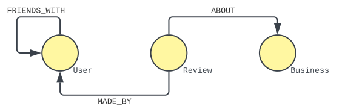
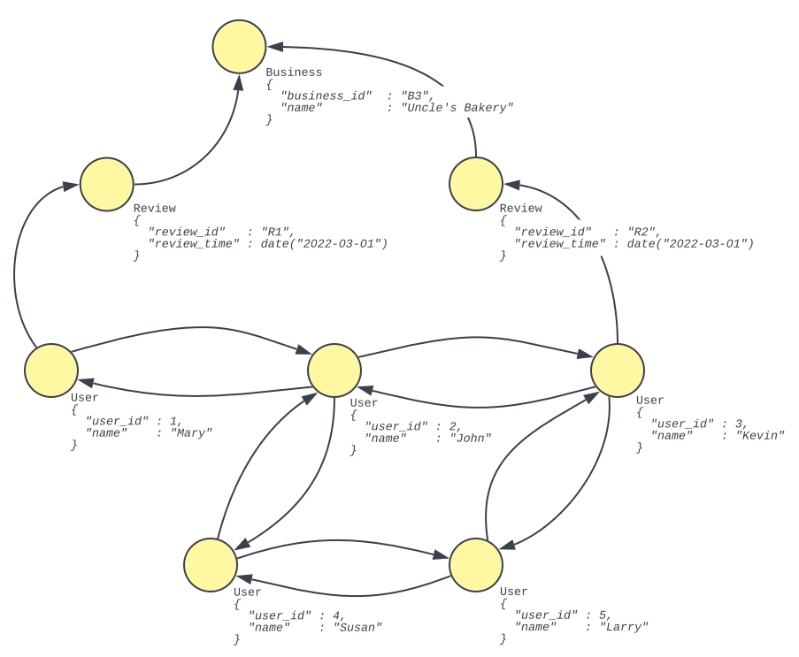

# Graphix Query Model
{: .no_toc }

## Table of Contents
{: .no_toc .text-delta }

1. TOC
{: toc }

## Property Graph Data Model
A _graph_ is a structure composed of sets of _graph elements_ known as _vertices_ and _edges_.
Edges connect exactly two vertices together.
A _property graph_ has four defining characteristics that differentiate itself from your bog-standard undirected simple graph:
- Each edge is _directed_.
  Consequently, given an edge _<u>e</u>_ that connects two vertices we can talk about the _source vertex_ and the _destination vertex_ of _<u>e</u>_.
- Each graph element is associated with a _label_.
  In the context of the property graph model labels are used to group vertices with other vertices, and edge with other edges.
- Two pairs of vertices may be connected by more than one edge.
- Each graph element possesses a set of key-value pairs, also known as _properties_.

The property graph model (in contrast to other types of graph models) has received a lot of attention this past decade for its flexibility and ability to express other types of graph models by omitting or re-purposing certain characteristics of the property graph model itself.
For example, if your domain requires weights on your vertices or edges, you simply add a weight property to the appropriate graph elements.
If your domain requires undirected graphs, then simply assign an arbitrary direction to your edge and ignore the direction when querying.
Property graphs can even be used to represent RDF graphs by repurposing graph element labels as URIs.

To better explain this section on property graph models (and the majority of this entire reference), we introduce the Gelp example.
We want to model the following statement:

_**Users** and their friends make **Reviews** about **Businesses**._
{: .fw-400 .text-center }

Graphically, we can represent this statement as follows:

    

{: .code-example }

In the figure above, we describe the graph _schema_ of Gelp.
_<u>User</u>_, _<u>Review</u>_, and _<u>Business</u>_ are labels that are used to categorize vertices.
Between these vertices, there are three types of edges:

1. A _User_ could be _<u>FRIENDS_WITH</u>_ another _User_.
2. A _Review_ is _<u>MADE_BY</u>_ a _User_.
3. A _Review_ is _<u>ABOUT</u>_ a _Business_.

_FRIENDS_WITH_, _MADE_BY_, and _ABOUT_ are labels that are used to categorize these different types of edges.

Let us now take a look at an instance of Gelp.

    

{: .code-example }

In the figure above, there are eight vertices.
The properties of each vertex are given in the ADM instance immediately below the vertex itself.

## Property Graph Query Model
It should come as no surprise that the connected structure of graphs allow us to pose numerous types of questions that would be difficult or impossible to express in other types of data models.
In this broad universe of questions we can ask about a graph, we focus on two areas:
1. Pattern Matching
2. Path Finding

Graph databases should ideally allow support for both operations above.

### Pattern Matching Queries
Let us first describe the problem of _pattern matching_ in graphs.
A _graph pattern_ can be thought of as another graph, framing the problem of _pattern matching_ as finding all valid mappings of our graph pattern to the graph we are querying.
To give an example, let us define a graph pattern composed of a _User_, a _Review_, and a _MADE_BY_ edge.

    

{: .code-example }

To match the pattern above to the instance of the Gelp graph above yields the following mappings:

    

{: .code-example }

{::comment}
A natural question that arises when talking about pattern matching is "how do we determine these mappings?".
There are four common ways we can determine if a pattern actually maps to an instance:
1. **Adjacency-preserving only**
    Minimally, we must ensure that each edge in a pattern corresponds to an edge in our graph.
    If we do not enforce anything else, then the problem of pattern matching becomes finding _homomorphisms_ between our pattern and our graph.
    The less fancy way of describing these semantics is _adjacency-preserving only_.
2. **No repeated vertices**
    In addition to preserving adjacency, we can also enforce that no two vertices in a mapping are the same.
    If we do not enforce anything else, we describe these semantics as _vertex isomorphism_, or _no repeated vertices_.
3. **No repeated edges**
    Similarly, we can impose a uniqueness constraint on the edges of a mapping.
    If we preserve adjacency and only constrain that edges of a mapping must be unique, then we describe these semantics as _edge isomorphism_, or _no repeated edges_.
4. **No repeated anything**
    Finally, we reach the strictest way we can determine a mapping: preserve adjacency, and ensure that no edge _and_ vertex is repeated.
    In contrast to the first approach, the problem of pattern matching with these semantics becomes finding _isomorphisms_ between our pattern and our graph.
    The less fancy way of describing these semantics is _no repeated anything_.
{:/comment}

### Navigational Queries (Path Finding)
Next we'll describe the problem of _path finding_, or finding a path between two vertex instances.
In contrast to pattern matching, in path finding we _do not_ know the exact pattern between two vertices.
Instead of describing a pattern, we describe a _path_ to find all valid mappings of our path description to edge instances in our graph.
When we use regular expressions to describe our paths, we classify our path finding problem as answering _regular path queries_ (RPQs).
To give an example, let us define a graphical path description of a path between 1 and 5 hops, composed only of _FRIENDS_WITH_ edge instances.
The vertices we are interested in finding a path between are the user "Mary" and the user "Kevin" (directed from "Mary" to "Kevin").

    

{: .code-example }

To match the path description above between the "Mary" and the "Kevin" vertices yields the following paths:

    

{: .code-example }

In our result set, we only consider paths that _do not_ repeat edges or vertices.
Different systems have different semantics with respect to what paths they consider.
In Graphix, cycles are never considered unless explicitly specified.

{::comment}
Similar to pattern matching, there are a variety of different semantics when asking "what is a valid path"?
There are four common approaches to path finding:
1. **All path / arbitrary path**
    The least restrictive approach to path query evaluation is to simply consider all paths.
    Under these semantics, we may encounter an infinite number of paths if cycles exist.
    To practically consider such an approach, we could choose to bound the number of paths we yield.
    We describe these semantics as _arbitrary path_ or _all path_.
2. **Path w/ no-repeated-vertices**
    The biggest issue with the previous evaluation approach is that we consider cycles.
    In most cases though, we can live without considering cycles in our result.
    The first restriction we can apply is to only yield _simple paths_, or paths that do not repeat vertices.
    We describe these semantics as _no-repeated-vertices_.
3. **Path w/ no-repeated-edges**
    Similar to the second approach, we can also choose to instead not repeat edges instead of vertices.
    We describe these semantics as _no-repeated-edges_.
4. **Shortest path**
    Finally, the last common approach to evaluation is to only consider the shortest paths.
    By only considering the path with the smallest number of vertices and edges, we rule out cycles and avoid the problem from the first approach.
    We describe these semantics as _shortest path_.
{:/comment}

### Navigational Pattern Matching Queries
The two prior sections describe two distinct classes of graph queries, though it's easy to see how we create queries that involve both pattern matching and path finding (with regular expressions).
The superclass of queries described here is known formally as _conjunctive regular path queries_, or _navigational pattern matching queries_.
To extend the _FRIENDS_WITH_ example from the previous section, suppose we are now interested in finding such a path between _any_ pair of users that have made a review.
Graphically, we describe our query as such:

    

{: .code-example }

To evaluate the navigational pattern matching query above yields the following results:

    

{: .code-example }

Navigational pattern matching provides the foundation of most graph query languages (e.g. SPARQL, Cypher, Gremlin).

## Graphix Query Model
Having described the property graph model and common classes of queries on property graphs, let us now describe the query model for Graphix.
All gSQL++ queries return ADM (Asterix data model) instances.
With respect to pattern matching semantics, Graphix (by default) will not repeat vertices or edges in a pattern.
With respect to path finding, Graphix (by default) will consider all paths that do not repeat vertices or edges.

